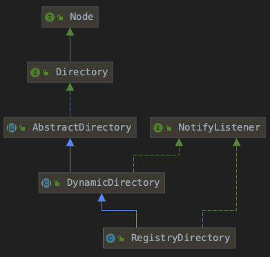

## Dubbo源码分析（三） - Directory


##### 重点：Directory、Invoker、Registry、NotifyListener、RouterChain

##### 类图：




##### 服务目录（Directory）：

- 存储了一些和服务提供者有关的信息，通过服务目录，服务消费者可获取到服务提供者的信息，比如 ip、端口、服务协议等

- 服务目录在获取注册中心的服务配置信息后，会为每条配置信息生成一个 Invoker 对象，并把这个 Invoker 对象存储起来，这个 Invoker 才是服务目录最终持有的对象
- 服务目录可以看做是 Invoker 集合，且这个集合中的元素会随注册中心的变化而进行动态调整
- RegistryDirectory 实现了 NotifyListener 接口，当注册中心节点信息发生变化后，RegistryDirectory 可以通过此接口方法得到变更信息，并根据变更信息动态调整内部 Invoker 列表


##### list方法：

```java
public interface Directory<T> extends Node {

    /**
     * get service type.
     *
     * @return service type.
     */
    Class<T> getInterface();

    /**
     * list invokers.
     *
     * @return invokers
     */
    List<Invoker<T>> list(Invocation invocation) throws RpcException;

}
```

- 调用 doList 获取 Invoker 列表
- 根据 Router 的 getUrl 返回值为空与否，以及 runtime 参数决定是否进行服务路由（服务路由章节会深入解析）
- Router 的 runtime 参数这里简单说明一下，这个参数决定了是否在每次调用服务时都执行路由规则。如果 runtime 为 true，那么每次调用服务前，都需要进行服务路由。这个对性能造成影响，配置时需要注意


##### RegistryDirectory：

- Invoker 的列举逻辑（list - doList）

- 接收服务配置变更的逻辑（notify）

- Invoker 列表的刷新逻辑（refreshInvoker）

  - **URL -> Invoker（toInvokers）**

    - ```java
      invoker = new InvokerDelegate<>(protocol.refer(serviceType, url), url, providerUrl);
      ```


##### 源码疑点解析：

queryMap：存放URL解析后的所有参数配置信息


ConsumerUrl：服务消费者 url


